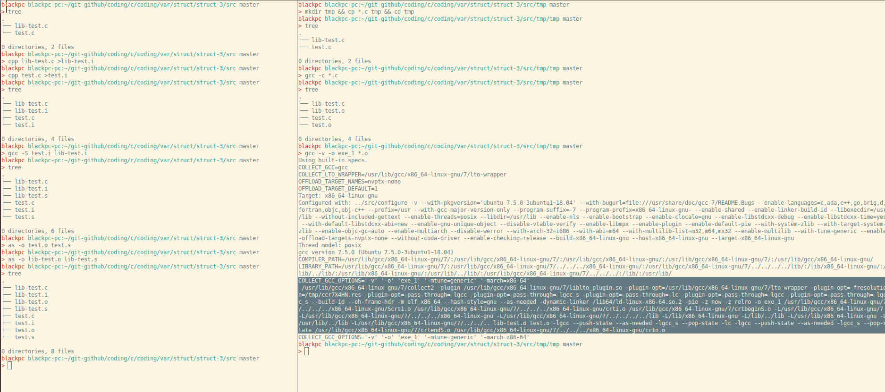

# Compile

## Compilation

- [univ lille](https://www.fil.univ-lille1.fr/~sedoglav/PDC2/main006.html#sec9)
- [pratique](https://www3.ntu.edu.sg/home/ehchua/programming/cpp/gcc_make.html)

## Linker

### Overview




### Reference

- [stackoverflow](https://stackoverflow.com/questions/14163208/how-to-link-c-object-files-with-ld)
- [gnu collect2](https://gcc.gnu.org/onlinedocs/gccint/Collect2.html)
- [ntu](https://www3.ntu.edu.sg/home/ehchua/programming/cpp/gcc_make.html)

## Read file objects `.o` (under linux)

Assuming that we did as follow

- `gcc -c hello.c` => file object `hello.o` is generated

then, we can read `hello.o` file like this `bvi hello.o`

### `bvi`

_First install `bvi` with the command line `sudo apt install bvi`_

```bash
bvi <object_file>
```

> `:set cm=8` to print exactly 8 columns that is to say 8 bytes

#### Example

[bvi_gdb_main](img/bvi_gdb_main.png)

### `od` or (`hexdump`)

```bash
od -A x -t xz -v -w8 hello.o
```

## Biblio

- [renenyffengger](https://renenyffenegger.ch/notes/development/languages/C-C-plus-plus/GCC/create-libraries/index)
- [geeks for geeks](https://www.geeksforgeeks.org/compiling-with-g-plus-plus/)
- [useful macro gnu](https://gcc.gnu.org/onlinedocs/cpp/Standard-Predefined-Macros.html)
- [ELF](https://refspecs.linuxbase.org/elf/gabi4+/ch4.intro.html)
