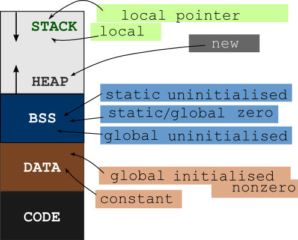

# Mémoire

# Architecture

|bits|taille pointeur (bits)|octet|hexadecimal|
|----|---------------|-----|-----------|
|32|32|4|8 digits|
|64|64|8|16 digts|

## Exemple

### C source file

```c
#include <stdio.h>
#include <stdlib.h>

int main(int argc, char *argv[]) {
  char *p_arg = NULL;
  int indice = 0;

  for (p_arg = argv[0]; p_arg < argv[argc]; p_arg++) {
    printf("%d : %s\n", indice++, p_arg);
  }
}
```

### Compilation

- `gcc -ggdb -o mem mem.c`

### Execution

- `./mem 0 1 2 3 4`

### gdb

- `gdb mem` 

> `r 0 1 2 3 4` \
> `b main` \
> `n` \
> `p argv` \
> `p &argv[0]` \
> ...

#### Observation

- `arch` => x86_64 (information concernant l'architecture de l'ordinateur)

> la taille d'un pointeur est de 64 bits


```bash
(gdb) p &argv[0]
$33 = (char **) 0x7fffffffde78
(gdb) p &argv[1]
$34 = (char **) 0x7fffffffde80
(gdb) p &argv[2]
$35 = (char **) 0x7fffffffde88
```

> `&argv[0]` est l'adresse de la première cellule du tableau contenant des `char *` \
> `&argv[0]` est de type `char **` \
> `&argv[0] + 1` (arithmétique des pointeurs) \
> car une adresse est sur `64 bits` ce qui correspond à `8 octets` \
> et qui explique les adresses précédentes

sachant que la taille d'un `char` en mémoire est précisément de `1 octet`

##### Organisation de la mémoire

- organisée à l'octet
- la plus petite zone accessible est de `1 octet`

> `0x7fffffffde78` réfère à la première cellule d'adresse `&argv[0]` \
> - qui contient un pointeur, donc une adresse sur 8 octets car archi `x86_64` \
> Les cellules d'un tableau sont contigües, donc l'adresse `&argv[1]` doit suivre immédiatement `&argv[0]` \
> on peut en déduire que `&argv[1]` est à l'adresse `&argv[0] + 8` \
> - un pointeur nécessite `64 bits` soit 8 octets \
> - un emplacement mémoire a une capacité de 1 octet (car mémoire organisée à l'octet) \
> il faut donc 8 octets pour stocker un pointeur en mémoire \
> la prochaine adresse disponible sera 8 octets plus loin \
> une adresse, `64 bits` dénote un emplacement mémoire (RAM) de `1 octet` \

```python
>>> hex(0x7fffffffde78 + 8)
'0x7fffffffde80'
```

> qui correspond bien à

```gdb
 57 (gdb) p &argv[1]
 58 $34 = (char **) 0x7fffffffde80
```

## Segments




## Biblio

- [alignement mémoire](https://courses.cs.washington.edu/courses/cse351/17au/lectures/14/CSE351-L14-structs_17au.pdf)
- [damien rohmer](https://imagecomputing.net/damien.rohmer/data/previous_website/documents/teaching/14_0fall_cpe/3eti_software_development_c/cours/cours7_imprimable.pdf)
- [sourceware x/s, x/i, ...](https://sourceware.org/gdb/current/onlinedocs/gdb/Memory.html)
- [AMD64 Architecture](https://www.amd.com/system/files/TechDocs/24592.pdf)
- [wikipedia data segment](https://fr.wikipedia.org/wiki/Segment_de_donn%C3%A9es#Segment_BSS)
- [nandu310](https://nandu310.wordpress.com/2009/11/09/memory-areas-in-c-language/)
- [stackoverflow](https://stackoverflow.com/questions/3684760/where-are-the-local-global-static-auto-register-extern-const-volatile-var/3685092#3685092)
- [cppreference declarations](https://en.cppreference.com/w/c/language/declarations)
