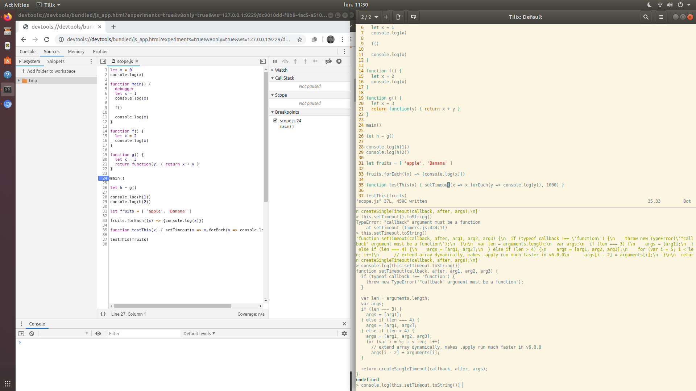

# Javascript

## Installation

- `sudo apt install nodejs`

### Settings

Some extra modules : [doali esm](https://github.com/doali/linux/blob/master/ubuntu/etc/install-esm.sh)

## Interpreter

In a terminal `nodeJS` or else `node`

## Biblio
- [delicious](https://delicious-insights.com/fr/articles/dix-bonnes-pratiques-javascript/)
- [MDN](https://developer.mozilla.org/en-US/docs/Web/JavaScript)
- [openclassroom](https://openclassrooms.com/fr/courses/2984401-apprenez-a-coder-avec-javascript)
- [CORS](https://developer.mozilla.org/en-US/docs/Web/HTTP/CORS)
- [sitepoint this](https://www.sitepoint.com/back-to-basics-javascript-object-syntax/)
- [mozilla this ](https://developer.mozilla.org/fr/docs/Web/JavaScript/Reference/Fonctions/Fonctions_fl%C3%A9ch%C3%A9es)
