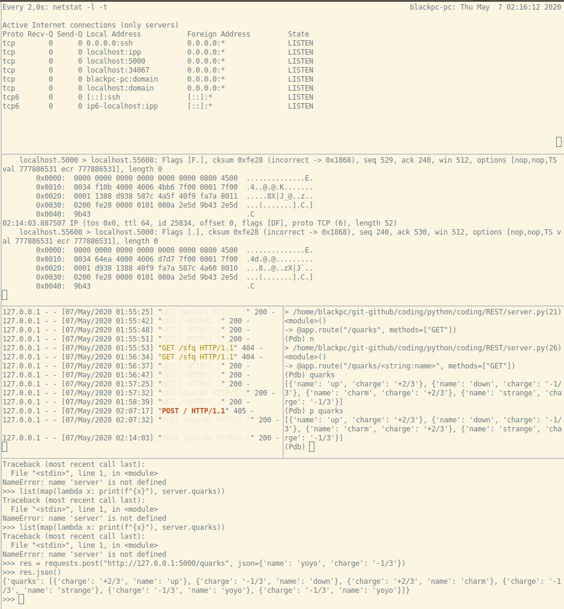
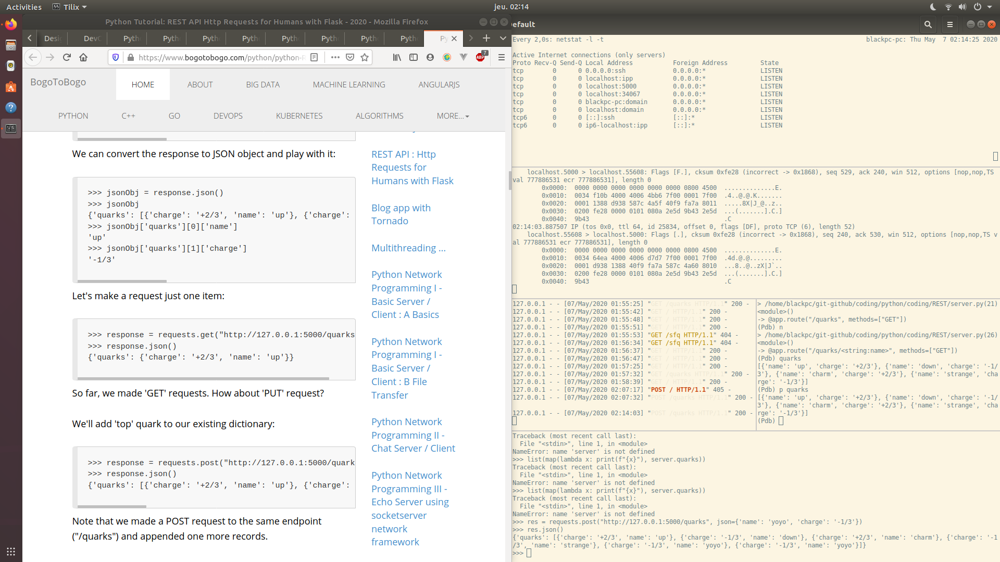

# Flask

## Install

```bash
#!/usr/bin/env bash

# ------------------------------------------------------------------------------
# Preparation de l'environnement pour utiliser
#- flask
#- emettre des requetes
# ------------------------------------------------------------------------------

# list des modules installés
# au niveau global
#pip3 freeze

# création d'un environnement virtuel python
# nommé FLASK
python3 -m venv FLASK

# Activation de l'environnement FLASK
source FLASK/bin/activate

# Installation des modules pour
# - flask
pip3 install flask
pip3 install requests

# liste des modules installés
# dans l'environnement virtuel
#pip3 freeze

# Sauvegarde
#pip3 freeze >requirements_flask

# Chargement, installation de modules
# depuis un fichier d'export
#pip3 -r requirements_flask
```

- [doali prepare.sh](coding/python/coding/REST/prepare.sh)

### Requirements

```python
certifi==2020.4.5.1
chardet==3.0.4
click==7.1.2
Flask==1.1.2
idna==2.9
itsdangerous==1.1.0
Jinja2==2.11.2
MarkupSafe==1.1.1
pkg-resources==0.0.0
requests==2.23.0
urllib3==1.25.9
Werkzeug==1.0.1
```

## Code

- [doali server.py](coding/python/coding/REST/server.py)

### Run

```bash
#!/usr/bin/env bash

# Lancement du serveur
# http://127.0.0.1:5000
python3 server.py
```

## Scenario

```bash
# ==============================================================================
# Exemple d'un scenario
# - utiliser flask
# ==============================================================================
# Dans tilix

# ------------------------------------------------------------------------------
# Dans les terminaux penser à sourcer
#python3 -m venv FLASK # création virtual environment named FLASK
source FLASK/bin/activate

# ------------------------------------------------------------------------------
# lancer le serveur dans un terminal
python3 server.py # http://127.0.0.1:5000 par défaut

# Chromium
http://127.0.0.1:5000
# Termux...
# ssh -L 5000:localhost:5000 <user>@<ip_host> # avec Flask tournant sur <ip_host>
# browser: http://127.0.0.1:5000
# ...

# ------------------------------------------------------------------------------
# lancer tcpdump dans un autre
# -i : interface <= BIEN CHOISIR !!
# lo : sur la loopback
sudo tcpdump -vvv -XX -i lo 'tcp port 5000'
#sudo tcpdump -vvv -X -i lo 'tcp port 5000'

# ------------------------------------------------------------------------------
# lancer netstat dans un autre
# -l : listen (--listening)
# -t : tcp (--tcp)
watch netstat -l --tcp

# ==============================================================================
# ENVOYER DES REQUETES
# ------------------------------------------------------------------------------
# Dans l'interpreteur python3
# ------------------------------------------------------------------------------
$ python3
>>> import request
# ------------------------------------------------------------------------------
>>> res = requests.get("http://127.0.0.1:5000")
>>> res.json()
{'message': 'Hello, World!'}
# ------------------------------------------------------------------------------
>>> res = requests.get("http://127.0.0.1:5000/quarks")
>>> res.json()
{'quarks': [{'charge': '+2/3', 'name': 'up'}, {'charge': '-1/3', 'name': 'down'}, {'charge': '+2/3', 'name': 'charm'}, {'charge': '-1/3', 'name': 'strange'}, {'charge': '-1/3', 'name': 'yoyo'}, {'charge': '-1/3', 'name': 'yoyo'}]}
# ------------------------------------------------------------------------------
>>> res = requests.post("http://127.0.0.1:5000/quarks", json={'name': 'yoyo', 'charge': '-1/3'})
>>> res.json()
{'quarks': [{'charge': '+2/3', 'name': 'up'}, {'charge': '-1/3', 'name': 'down'}, {'charge': '+2/3', 'name': 'charm'}, {'charge': '-1/3', 'name': 'strange'}, {'charge': '-1/3', 'name': 'yoyo'}, {'charge': '-1/3', 'name': 'yoyo'}, {'charge': '-1/3', 'name': 'yoyo'}]}
>>>
# ------------------------------------------------------------------------------

# ------------------------------------------------------------------------------
# Avec cURL
# ------------------------------------------------------------------------------
curl -v http://127.0.0.1:5000
curl -v http://127.0.0.1:5000/quarks
curl -v http://127.0.0.1:5000/quarks -o out.json # réponse dans un fichier de sortie
curl -v http://127.0.0.1:5000/quarks >out.json   # réponse dans un fichier de sortie

cat <<EOF >@my_request_PUT
{'charge': '+7/7', 'name': 'coucou'}
EOF

curl -d '{"clef": 1, "key": "coucou"}' -X POST -H 'Content-Type: application/json' http://127.0.0.1:5000/quarks
# Avec un fichier
# - my_request.json
curl -d @my_request.json -X POST -H 'Content-Type: application/json'  http://127.0.0.1:5000/quarks


# ------------------------------------------------------------------------------
# ATTENTION aux QUOTES pour le fichier à envoyer => utiliser des " <=
# ------------------------------------------------------------------------------
#{"a":1,"b":2} # OK
# ------------------------------------------------------------------------------
#{'a':1,'b':4} # KO
# ------------------------------------------------------------------------------
```

## tilix




## Biblio

- [bogotobogo](https://www.bogotobogo.com/python/python-REST-API-Http-Requests-for-Humans-with-Flask.php)
