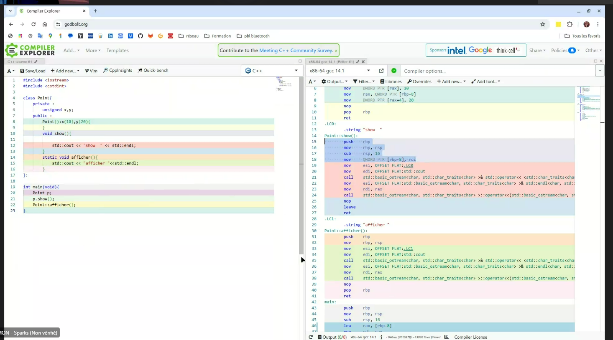

# Notes Formation Securite

## Alloca

> Allocation sur la pile

## Canari

## Cookies et session

## Gitpod

> La vue de desassemblage

## SQL injection

> Exploitation de la concatenation d'une requête toujours vraie

## This

> Passage de this en premier parametre

## `printf`

> Execution de code
